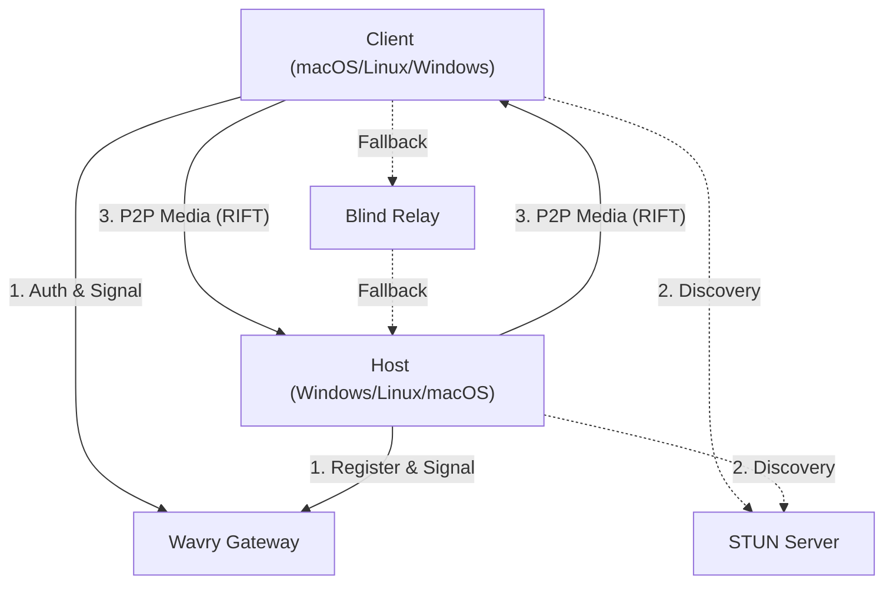

# WAVRY: Latency-First Streaming Platform

[](https://www.rust-lang.org/)
[](docs/RIFT_SPEC_V1.md)
[](LICENSE)

---

## The Manifesto

Wavry is built on the premise that latency is a primary feature, not a secondary metric. While existing solutions provide high-quality video, Wavry focuses on the mathematical optimization of the entire pipeline—from capture to presentation.

1.  **Input is Sacred**: We process input on high-priority threads that operate independently of video encoding to ensure responsiveness even under heavy system load.
2.  **Delay-Oriented Control**: Our DELTA congestion control prioritizes queuing delay trends over throughput, maintaining minimal buffers for a near-zero standing queue.
3.  **Privacy by Design**: Identity is established via Ed25519 keypairs. Authentication is handled through challenge-response signatures. We do not store or process user passwords.
4.  **Hardware Native**: We utilize platform-native media APIs (Windows Graphics Capture/Media Foundation, Metal/ScreenCaptureKit, VA-API/PipeWire) to achieve maximum performance.
5.  **P2P First**: We aggressively prioritize direct connections using STUN for NAT traversal. Encrypted relay fallback is used only as a last resort.

---

## System Architecture

Wavry is a modular system composed of several specialized crates.



### Core Ecosystem

| Crate | Layer | Description |
|:---|:---|:---|
| **`rift-core`** | **Protocol** | Implementation of the RIFT wire format, DELTA congestion control, and FEC. |
| **`rift-crypto`** | **Security** | Noise_XX handshake, ChaCha20-Poly1305 AEAD, and identity management. |
| **`wavry-media`** | **Hardware** | Hardware-accelerated capture and encoding (WGC, Media Foundation, Metal). |
| **`wavry-client`** | **Session** | Client-side session management, signaling, and RTT tracking. |
| **`wavry-desktop`** | **Integration** | Tauri-based host and client application for Windows and Linux. |
| **`wavry-gateway`** | **Signaling** | Real-time signaling gateway for peer coordination and SDP exchange. |
| **`wavry-relay`** | **Transport** | Blind UDP forwarder for encrypted traffic. |

---

## RIFT Protocol

Remote Interactive Frame Transport (RIFT) is a UDP-based protocol designed for high-performance interactive streaming.

### Congestion Control (DELTA)
The Differential Latency Estimation and Tuning Algorithm (DELTA) is a delay-oriented controller:
- **Measurement**: Tracks one-way queuing delay through RTT smoothing.
- **Reaction**: Adjusts bitrate based on slope trends (Rising, Stable, Congested).
- **FEC**: Dynamically adjusts Forward Error Correction redundancy based on network stability.

### Forward Error Correction (FEC)
RIFT employs XOR-based parity groups to recover from packet loss:
- **Host**: Generates parity shards for groups of video/audio packets.
- **Client**: Reconstructs missing packets using the parity payload to avoid retransmission delays.

---

## Security

- **Identity**: Users are identified by Ed25519 public keys.
- **Lease Validation**: Relay access requires a signed PASETO lease token.
- **Encryption**: Mandatory end-to-end encryption using ChaCha20-Poly1305.

---

## Installation and Development

### Prerequisites
- **Rust**: 1.75+ (Stable)
- **Dependencies**: `protobuf-compiler`, `pkg-config`
- **Windows**: Windows 10/11 with DirectX support.
- **macOS**: Xcode 15+ for Metal and ScreenCaptureKit.

### Building
```bash
git clone https://github.com/bybrooklyn/wavry.git
cd wavry
cargo build --release --workspace
```

### Running Infrastructure (Local)
1.  **Gateway**
    ```bash
    cargo run --bin wavry-gateway
    ```
2.  **Relay**
    ```bash
    cargo run --bin wavry-relay -- --master-url http://localhost:8080
    ```

---

## Contributing

Technical contributions are welcome. Please ensure any changes to the protocol are documented and accompanied by relevant unit tests.

---

## License

Wavry is licensed under the **GNU Affero General Public License v3.0 (AGPL-3.0)**. See [`LICENSE`](LICENSE) for details.