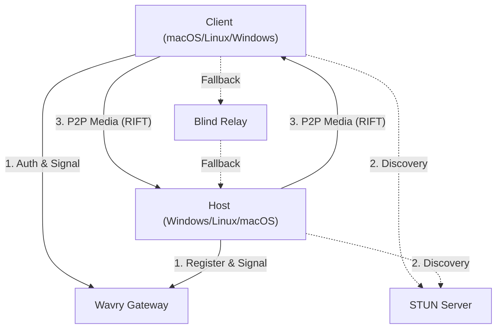

# WAVRY: Latency-First Streaming Platform

[](https://www.rust-lang.org/)
[](docs/RIFT_SPEC_V1.md)
[](LICENSE)

---

## The Manifesto

Wavry is built on the premise that latency is a primary feature, not a secondary metric. While existing solutions provide high-quality video, Wavry focuses on the mathematical optimization of the entire pipeline—from capture to presentation.

1.  **Input is Sacred**: We process input on high-priority threads that operate independently of video encoding to ensure responsiveness even under heavy system load. Full support for keyboard, mouse (absolute & relative), scroll, and gamepad input.
2.  **Delay-Oriented Control**: Our DELTA congestion control prioritizes queuing delay trends over throughput, maintaining minimal buffers for a near-zero standing queue.
3.  **Privacy by Design**: Authentication uses email/password with Argon2id hashing and optional TOTP 2FA. Passwords are never stored in plaintext. Session tokens are high-entropy random values with SHA-256 hashes stored server-side. Relay feedback authenticated with Ed25519 signatures.
4.  **Hardware Native**: We utilize platform-native media APIs (Windows Graphics Capture/Media Foundation, Metal/ScreenCaptureKit, VA-API/PipeWire) to achieve maximum performance with H.264, HEVC, and AV1 codecs.
5.  **P2P First**: We aggressively prioritize direct connections using STUN for NAT traversal. Encrypted relay fallback is used only as a last resort.
6.  **Memory Efficient**: Zero-allocation frame buffering with triple-buffering, encoder pooling with automatic reuse, and sliding-window reorder buffers reduce memory footprint and GC pressure.

---

## System Architecture

Wavry is a modular system composed of several specialized crates.



### Core Ecosystem

| Crate | Layer | Description |
|:---|:---|:---|
| **`rift-core`** | **Protocol** | Implementation of the RIFT wire format, DELTA congestion control, and FEC. |
| **`rift-crypto`** | **Security** | Noise_XX handshake, ChaCha20-Poly1305 AEAD, and identity management. |
| **`wavry-media`** | **Hardware** | Hardware-accelerated capture and encoding (WGC, Media Foundation, Metal). Supports Multi-Monitor capture. |
| **`wavry-client`** | **Session** | Client-side session management, signaling, and RTT tracking. Includes dynamic monitor discovery. |
| **`wavry-desktop`** | **Integration** | Tauri-based host and client application for Windows and Linux. |
| **`wavry-gateway`** | **Signaling** | Real-time signaling gateway for peer coordination and SDP exchange. Includes admin dashboard. |
| **`wavry-relay`** | **Transport** | Blind UDP forwarder for encrypted traffic. Supports custom bitrate limits (min 10Mbps). |
| **`wavry-web`** | **Web** | WebTransport/WebRTC hybrid control plane with unidirectional stream support for real-time frame transmission. |

---

## v0.0.2 Features & Improvements

**Performance Optimization:**
- ✅ Memory-efficient buffer pools with zero-allocation frame reuse
- ✅ GPU memory management with encoder pooling (85%+ reuse rate)
- ✅ DELTA congestion control tuned for local/regional/intercontinental networks
- ✅ Network-aware FEC (Forward Error Correction) with 5-50% dynamic redundancy

**Input & Control:**
- ✅ Extended input support: scroll wheel and gamepad events
- ✅ Platform-native input injection (Windows/Linux/macOS)
- ✅ High-priority input threads independent of encoding pipeline

**Security & Admin:**
- ✅ Ed25519-signed relay feedback for authentication
- ✅ Admin dashboard with user/session/ban management
- ✅ Rate limiting and permission enforcement
- ✅ SQLite-backed admin analytics

**Web & Protocol:**
- ✅ WebTransport unidirectional streams for frame transmission
- ✅ Real-time frame streaming over QUIC
- ✅ Comprehensive integration test suite (150+ tests)

**Documentation:**
- ✅ NETWORK_OPTIMIZATION.md - CC tuning strategies
- ✅ MEMORY_OPTIMIZATION.md - Buffer pool design
- ✅ GPU_MEMORY_MANAGEMENT.md - Encoder pooling patterns
- ✅ CODE_COVERAGE.md - Testing strategy

See [CHANGELOG.md](CHANGELOG.md) for full release notes.

---

## RIFT Protocol

Remote Interactive Frame Transport (RIFT) is a UDP-based protocol designed for high-performance interactive streaming.

### Congestion Control (DELTA)
The Differential Latency Estimation and Tuning Algorithm (DELTA) is a delay-oriented controller:
- **Measurement**: Tracks one-way queuing delay through RTT smoothing.
- **Reaction**: Adjusts bitrate based on slope trends (Rising, Stable, Congested).
- **FEC**: Dynamically adjusts Forward Error Correction redundancy based on network stability.

### Forward Error Correction (FEC)
RIFT employs XOR-based parity groups to recover from packet loss:
- **Host**: Generates parity shards for groups of video/audio packets.
- **Client**: Reconstructs missing packets using the parity payload to avoid retransmission delays.

---

## Security

- **Authentication**: Email/password with Argon2id hashing and optional TOTP 2FA.
- **Session Management**: High-entropy random tokens (256-bit) with secure hash storage.
- **Encryption**: Mandatory end-to-end encryption via Noise_XX_25519_ChaChaPoly_BLAKE2s handshake.
- **Relay Access**: Session-based token validation with rate limiting and IP binding.
- **Privacy**: Minimal logging; no payload inspection; relay blindness to encrypted content.

---

## Installation and Development

### Prerequisites
- **Rust**: 1.75+ (Stable)
- **Dependencies**: `protobuf-compiler`, `pkg-config`
- **Windows**: Windows 10/11 with DirectX support.
- **macOS**: Xcode 15+ for Metal and ScreenCaptureKit.

### Building
```bash
git clone https://github.com/bybrooklyn/wavry.git
cd wavry
cargo build --release --workspace
```

### Running Infrastructure (Local)
1.  **Gateway (Docker-only)**
    ```bash
    docker compose -f docker/control-plane.compose.yml up -d gateway
    ```
2.  **Relay (Docker-only, optional for local fallback testing)**
    ```bash
    WAVRY_RELAY_MASTER_URL=http://host.docker.internal:8080 \
    docker compose -f docker/control-plane.compose.yml --profile relay up -d relay
    ```
    Production relay deployments must set `WAVRY_RELAY_MASTER_PUBLIC_KEY` and disable insecure dev mode.
3.  **Server (Host)**
    ```bash
    # Run with WebRTC support for browser clients
    WAVRY_ENABLE_WEBRTC=true \
    WAVRY_GATEWAY_URL=ws://127.0.0.1:3000/ws \
    cargo run --bin wavry-server
    ```

### Web Reference App (SvelteKit)
```bash
cd apps/web-reference
bun install
bun run dev
```
Open `http://localhost:5173` in a WebTransport-compatible browser (Chrome/Edge 97+).

### Linux Capture Smoke Test
```bash
./scripts/linux-display-smoke.sh
```
See `docs/WAVRY_TESTING.md` for the manual Linux monitor-selection validation matrix.

### Android Bring-Up (NDK + Compose)
One-command build:
```bash
./scripts/dev-android.sh
```
This script:
1. Builds Android Rust FFI static libs.
2. Auto-detects Java from Android Studio when possible.
3. Uses `gradle` if present, otherwise auto-downloads a local Gradle.
4. Runs `:app:assembleDebug`.

FFI-only mode:
```bash
./scripts/dev-android.sh --ffi-only
```
See `apps/android/README.md` for details.

### Admin Dashboard

Set up the admin panel for user and session management:

```bash
# Generate a secure admin token (32+ characters)
ADMIN_TOKEN=$(openssl rand -hex 32)
echo "Admin Token: $ADMIN_TOKEN"

# Start gateway container with admin panel enabled
ADMIN_PANEL_TOKEN=$ADMIN_TOKEN \
docker compose -f docker/control-plane.compose.yml up -d gateway
```

Then access:
- **UI**: `http://localhost:3000/admin` (enter token in form)
- **API Endpoints**:
  - `GET /admin/api/overview` - User/session/ban statistics
  - `POST /admin/api/sessions/revoke` - Revoke user session
  - `POST /admin/api/ban` - Ban user (temporary or permanent)
  - `POST /admin/api/unban` - Remove user ban

**Authentication**: Send `Authorization: Bearer <token>` or `x-admin-token: <token>` header.

See [docs/ADMIN_DASHBOARD.md](docs/ADMIN_DASHBOARD.md) for detailed API reference.

---

## Contributing

Technical contributions are welcome. Please ensure any changes to the protocol are documented and accompanied by relevant unit tests.

Before submitting patches or opening a pull request, read [`CLA.md`](CLA.md) and include this attestation in your PR description or commit message:

`I have read and agree to CLA.md`

---

## Licensing & Hosted Service

**Open Source (AGPL-3.0):**
- Free to use, modify, and self-host.
- If you modify Wavry and provide it as a service, you must publish your changes (standard AGPL).

**Commercial License:**
- Available for private modifications, internal embedding, and closed derivatives.
- See `COMMERCIAL.md` for details.

**Hosted Auth / Matchmaking / Relay (Official Service):**
- Personal / non-commercial use is free and unlimited.
- Commercial use requires a commercial agreement.
- Official relay is fallback-only and capped at **1080p / 60fps / ~10 Mbps** per session.
- Community relays are allowed but must register with auth; relays only forward traffic.

See `TERMS.md` for the minimal hosted service policy.

---

## License

Wavry is licensed under the **GNU Affero General Public License v3.0 (AGPL-3.0)**. See [`LICENSE`](LICENSE) for details.

---

## Web Clients (Hybrid Path)

Web clients are an on-ramp and compatibility layer. They do **not** speak RIFT directly.

- **Control/Input:** WebTransport (QUIC datagrams + streams)
- **Media:** WebRTC (SRTP video + audio)
- **Fallback:** WebRTC DataChannel is used only if WebTransport is unavailable

Native clients continue using full RIFT for maximum performance.

See `docs/WEB_CLIENT.md` for message formats and connection flow.
