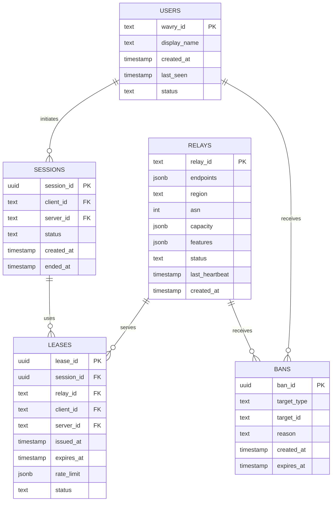
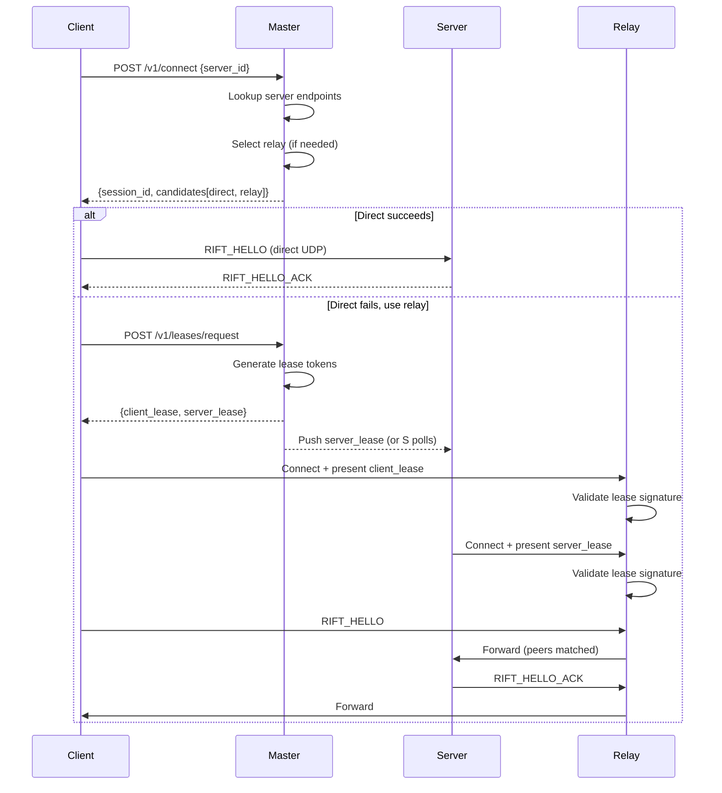

# Wavry Master — Design Specification v0.1

**Status:** Draft — Pending Review

Wavry Master is the central coordination service for identity, relay registration, lease issuance, and session matchmaking. It is a **directory + decision engine**, not a transport—Master never sees stream data.

---

## Production Endpoint

The production instance of Wavry Master (Auth/Matchmaker) is available at:
**`https://auth.wavry.dev`**

Clients should default to this URL for all signaling, unless manually overridden for development.

---

## Design Principles

| Principle | Rationale |
|-----------|-----------|
| **Master is blind** | Never proxies or inspects media; only issues credentials |
| **P2P by default** | Relays are optional fallbacks, not the primary path |
| **Short-lived leases** | Minimize blast radius; leases expire in minutes |
| **Ed25519 everywhere** | Single key scheme for users, relays, and leases |
| **Stateless tokens** | PASETO for session tokens; no server-side session store |

---

## 1. Identity System

### 1.1 Wavry ID

A **Wavry ID** is the Base64url-encoded Ed25519 public key (32 bytes → 43 characters).

```
WavryID = base64url_encode(ed25519_public_key)
```

### 1.2 Registration Flow

New users register by proving control of their private key:

```
Client                                  Master
   |                                       |
   |  POST /v1/auth/register               |
   |  { wavry_id, display_name }           |
   |-------------------------------------->|
   |                                       |
   |  200 { challenge: bytes32 }           |
   |<--------------------------------------|
   |                                       |
   |  POST /v1/auth/register/verify        |
   |  { wavry_id, signature(challenge) }   |
   |-------------------------------------->|
   |                                       |
   |  201 { session_token }                |
   |<--------------------------------------|
```

### 1.3 Login Flow

Returning users authenticate via challenge/response:

```
Client                                  Master
   |                                       |
   |  POST /v1/auth/login                  |
   |  { wavry_id }                         |
   |-------------------------------------->|
   |                                       |
   |  200 { challenge: bytes32 }           |
   |<--------------------------------------|
   |                                       |
   |  POST /v1/auth/login/verify           |
   |  { wavry_id, signature(challenge) }   |
   |-------------------------------------->|
   |                                       |
   |  200 { session_token }                |
   |<--------------------------------------|
```

### 1.4 Session Token (PASETO v4.local)

> **Why PASETO over JWT?**  
> - No algorithm confusion attacks (fixed Ed25519 for v4.public / XChaCha20-Poly1305 for v4.local)
> - Authenticated encryption by default
> - Simpler, safer API

**Token Claims:**

```json
{
  "sub": "<wavry_id>",
  "iat": 1706969400,
  "exp": 1706973000,
  "jti": "<uuid>",
  "scope": ["user"]
}
```

| Field | Description |
|-------|-------------|
| `sub` | Wavry ID (subject) |
| `iat` | Issued-at timestamp (Unix seconds) |
| `exp` | Expiry timestamp (default: 1 hour) |
| `jti` | Unique token ID for revocation |
| `scope` | Permission array (`user`, `relay`, `admin`) |

**Token Refresh:** Clients call `POST /v1/auth/refresh` with a valid (not-yet-expired) token to obtain a new one. The old `jti` is added to a short-lived revocation list.

---

## 2. Relay Registration

Community relays register with Master to join the pool.

### 2.1 Registration Flow

```
Relay                                   Master
   |                                       |
   |  POST /v1/relays/register             |
   |  { relay_id, endpoints[], region?,    |
   |    capacity, features[] }             |
   |-------------------------------------->|
   |                                       |
   |  200 { challenge: bytes32 }           |
   |<--------------------------------------|
   |                                       |
   |  POST /v1/relays/register/verify      |
   |  { relay_id, signature(challenge) }   |
   |-------------------------------------->|
   |                                       |
   |  201 { relay_token, heartbeat_url }   |
   |<--------------------------------------|
```

### 2.2 Relay Registration Payload

```json
{
  "relay_id": "<base64url ed25519 pubkey>",
  "endpoints": [
    { "ip": "203.0.113.42", "port": 4000, "proto": "udp" },
    { "ip": "2001:db8::1", "port": 4000, "proto": "udp" }
  ],
  "region": "us-east-1",
  "asn": 15169,
  "capacity": {
    "max_sessions": 100,
    "mbps": 1000
  },
  "features": ["udp", "ipv6", "fec"]
}
```

### 2.3 Heartbeat Protocol

Relays send periodic heartbeats (every 30s) to maintain registration:

```
POST /v1/relays/heartbeat
Authorization: Bearer <relay_token>

{
  "relay_id": "<id>",
  "active_sessions": 12,
  "bandwidth_mbps": 450,
  "uptime_secs": 86400
}
```

**Failure:** Missing 3 consecutive heartbeats marks the relay as `unhealthy`. After 5 minutes without heartbeat, relay is removed from active pool.

---

## 3. Lease Issuance

When P2P fails or is blocked, clients request a relay lease.

### 3.1 Lease Request Flow

```
Client                                  Master
   |                                       |
   |  POST /v1/leases/request              |
   |  { client_id, server_id, region? }    |
   |-------------------------------------->|
   |                                       |
   |  Master selects relay, issues leases  |
   |                                       |
   |  200 { client_lease, server_lease }   |
   |<--------------------------------------|
```

Master also pushes `server_lease` to the server via the session's control channel (or the server polls `/v1/leases/pending`).

### 3.2 Relay Lease Token (PASETO v4.public)

Leases are **signed** (not encrypted) so relays can verify them without holding a shared secret.

**Lease Claims:**

```json
{
  "iss": "wavry-master",
  "sub": "<session_id>",
  "iat": 1706969400,
  "exp": 1706969700,
  "nbf": 1706969400,
  "jti": "<lease_uuid>",
  "relay_id": "<relay pubkey>",
  "relay_endpoint": "203.0.113.42:4000",
  "peers": ["<client_wavry_id>", "<server_wavry_id>"],
  "allowed_ports": [4000, 4001],
  "rate_limit": {
    "soft_mbps": 50,
    "hard_mbps": 100
  },
  "nonce": "<random 16 bytes base64>",
  "seq_window": 1024
}
```

| Field | Description |
|-------|-------------|
| `iss` | Issuer (always `wavry-master`) |
| `sub` | Session ID binding this lease |
| `exp` | Expiry (default: 5 minutes; max: 15 minutes) |
| `nbf` | Not-before timestamp |
| `jti` | Unique lease ID |
| `relay_id` | Target relay's Wavry ID |
| `relay_endpoint` | IP:port to connect to |
| `peers` | Allowed peer Wavry IDs (exactly 2) |
| `allowed_ports` | Ports the relay should forward |
| `rate_limit` | Soft/hard throughput caps |
| `nonce` | Replay protection seed |
| `seq_window` | Sequence number window size |

### 3.3 Relay Validation Rules

Relays **must**:
1. Verify signature against Master's well-known public key
2. Reject expired leases (`exp < now`)
3. Reject future leases (`nbf > now + max_clock_skew`)
4. Verify `relay_id` matches their own identity
5. Only forward traffic between the two `peers`
6. Track sequence numbers within `seq_window` to prevent replay
7. Enforce `rate_limit.hard_mbps` (drop excess)

### 3.4 Lease Renewal

Clients request renewal before expiry:

```
POST /v1/leases/renew
Authorization: Bearer <session_token>

{
  "lease_id": "<jti from current lease>"
}
```

Response includes new leases with fresh `exp`, `nonce`, and `jti`. Old `jti` enters a short denial window.

---

## 4. Matchmaking

Matchmaking returns connection candidates for a session.

### 4.1 Connect Flow

```
Client                                  Master
   |                                       |
   |  POST /v1/connect                     |
   |  { server_id }                        |
   |-------------------------------------->|
   |                                       |
   |  200 { session_id, candidates[] }     |
   |<--------------------------------------|
```

### 4.2 Candidates Response

```json
{
  "session_id": "<uuid>",
  "server_wavry_id": "<server pubkey>",
  "candidates": [
    {
      "type": "direct",
      "priority": 1,
      "endpoints": [
        { "ip": "192.168.1.100", "port": 4000, "proto": "udp" },
        { "ip": "203.0.113.50", "port": 4000, "proto": "udp" }
      ]
    },
    {
      "type": "relay",
      "priority": 2,
      "relay_id": "<relay pubkey>",
      "endpoint": { "ip": "203.0.113.42", "port": 4000, "proto": "udp" },
      "lease": "<client_lease token (if pre-issued)>"
    }
  ],
  "ice_credentials": {
    "ufrag": "<short random>",
    "pwd": "<longer random>"
  }
}
```

**Candidate Selection Logic:**
1. Always include direct candidates (server-advertised endpoints)
2. Include relay candidates if:
   - Server or client request it
   - Region heuristics suggest NAT traversal issues
   - Previous direct attempts failed
3. Order by priority (lower = preferred)

---

## 5. API Reference

### 5.1 Auth Endpoints

| Method | Path | Auth | Description |
|--------|------|------|-------------|
| POST | `/v1/auth/register` | None | Start registration |
| POST | `/v1/auth/register/verify` | None | Complete registration |
| POST | `/v1/auth/login` | None | Start login |
| POST | `/v1/auth/login/verify` | None | Complete login |
| POST | `/v1/auth/refresh` | Token | Refresh session token |
| POST | `/v1/auth/logout` | Token | Revoke token |

### 5.2 Relay Endpoints

| Method | Path | Auth | Description |
|--------|------|------|-------------|
| POST | `/v1/relays/register` | None | Start relay registration |
| POST | `/v1/relays/register/verify` | None | Complete relay registration |
| POST | `/v1/relays/heartbeat` | Relay Token | Send heartbeat |
| GET | `/v1/relays` | Token | List healthy relays |
| DELETE | `/v1/relays/{relay_id}` | Admin | Remove relay |

### 5.3 Lease Endpoints

| Method | Path | Auth | Description |
|--------|------|------|-------------|
| POST | `/v1/leases/request` | Token | Request relay lease |
| POST | `/v1/leases/renew` | Token | Renew existing lease |
| GET | `/v1/leases/pending` | Token | Poll for lease offers |

### 5.4 Session Endpoints

| Method | Path | Auth | Description |
|--------|------|------|-------------|
| POST | `/v1/connect` | Token | Initiate connection |
| POST | `/v1/sessions/{id}/end` | Token | End session |
| GET | `/v1/sessions` | Token | List user's sessions |

### 5.5 Admin Endpoints

| Method | Path | Auth | Description |
|--------|------|------|-------------|
| POST | `/v1/admin/bans` | Admin | Ban user/relay |
| DELETE | `/v1/admin/bans/{id}` | Admin | Remove ban |
| GET | `/v1/admin/stats` | Admin | System statistics |

---

## 6. Data Model

### 6.1 Entity Relationship



### 6.2 Table Schemas

#### `users`

| Column | Type | Constraints |
|--------|------|-------------|
| `wavry_id` | TEXT | PRIMARY KEY |
| `display_name` | TEXT | NOT NULL |
| `created_at` | TIMESTAMPTZ | DEFAULT now() |
| `last_seen` | TIMESTAMPTZ | |
| `status` | TEXT | DEFAULT 'active' |

#### `relays`

| Column | Type | Constraints |
|--------|------|-------------|
| `relay_id` | TEXT | PRIMARY KEY |
| `endpoints` | JSONB | NOT NULL |
| `region` | TEXT | |
| `asn` | INT | |
| `capacity` | JSONB | NOT NULL |
| `features` | JSONB | DEFAULT '[]' |
| `status` | TEXT | DEFAULT 'pending' |
| `last_heartbeat` | TIMESTAMPTZ | |
| `created_at` | TIMESTAMPTZ | DEFAULT now() |

Indexes: `idx_relays_region`, `idx_relays_status`

#### `sessions`

| Column | Type | Constraints |
|--------|------|-------------|
| `session_id` | UUID | PRIMARY KEY |
| `client_id` | TEXT | FK → users |
| `server_id` | TEXT | FK → users |
| `status` | TEXT | DEFAULT 'pending' |
| `created_at` | TIMESTAMPTZ | DEFAULT now() |
| `ended_at` | TIMESTAMPTZ | |

Indexes: `idx_sessions_client`, `idx_sessions_server`, `idx_sessions_status`

#### `leases`

| Column | Type | Constraints |
|--------|------|-------------|
| `lease_id` | UUID | PRIMARY KEY |
| `session_id` | UUID | FK → sessions |
| `relay_id` | TEXT | FK → relays |
| `client_id` | TEXT | FK → users |
| `server_id` | TEXT | FK → users |
| `issued_at` | TIMESTAMPTZ | DEFAULT now() |
| `expires_at` | TIMESTAMPTZ | NOT NULL |
| `rate_limit` | JSONB | |
| `status` | TEXT | DEFAULT 'active' |

Indexes: `idx_leases_session`, `idx_leases_relay`, `idx_leases_expires`

#### `bans`

| Column | Type | Constraints |
|--------|------|-------------|
| `ban_id` | UUID | PRIMARY KEY |
| `target_type` | TEXT | 'user' or 'relay' |
| `target_id` | TEXT | NOT NULL |
| `reason` | TEXT | |
| `created_at` | TIMESTAMPTZ | DEFAULT now() |
| `expires_at` | TIMESTAMPTZ | |

Indexes: `idx_bans_target`

---

## 7. Failure Modes & Recovery

### 7.1 Challenge Expiry

| Scenario | Behavior |
|----------|----------|
| Challenge not verified within 60s | Challenge expires; client must restart |
| Invalid signature | 401 Unauthorized; no retry limit (keys are cryptographic) |

### 7.2 Token Failures

| Scenario | Behavior |
|----------|----------|
| Expired token | 401 with `error: token_expired` → refresh or re-login |
| Revoked token | 401 with `error: token_revoked` → re-login |
| Invalid token | 401 with `error: invalid_token` |

### 7.3 Relay Failures

| Scenario | Behavior |
|----------|----------|
| Heartbeat timeout | Mark relay `unhealthy` → exclude from selection |
| Relay unreachable | Client reports failure → Master re-issues lease to different relay |
| Lease expires mid-session | Client must renew proactively; grace period = 30s |

### 7.4 Lease Renewal Timeline

```
|------ Lease (5 min) ------|
|           80%             |  ← Client should renew here
|                    100%   |  ← Expires
|                      +30s |  ← Grace period (relay may still accept)
```

Clients receive `Lease-Expires` header with each response; they should renew at ~80% lifetime.

### 7.5 Session Recovery

| Scenario | Behavior |
|----------|----------|
| Direct connection fails | Client falls back to relay candidate |
| Relay connection fails | Master issues new lease to alternate relay |
| All candidates exhausted | Session fails; client must retry `/v1/connect` |

---

## 8. Security Considerations

### 8.1 Preventing Forged Relays

1. **Identity verification:** Relays must prove Ed25519 key ownership via challenge/response
2. **Endpoint validation:** Master can optionally probe advertised endpoints
3. **Reputation tracking:** Failed relay reports degrade trust score
4. **Ban mechanism:** Malicious relays are banned by admin; `bans` table enforced on all flows

### 8.2 Preventing Lease Reuse

1. **Unique `jti`:** Each lease has a unique ID tracked by the relay
2. **Strict expiry:** Relays reject any lease where `exp < now`
3. **Peer binding:** Lease is only valid for the two specified `peers`
4. **Session binding:** Lease is tied to a specific `session_id`

### 8.3 Replay Prevention

1. **Nonce in lease:** Each lease includes a unique `nonce`
2. **Sequence window:** Relays track packet sequence numbers per session
3. **Window violation:** Packets outside `seq_window` are dropped
4. **Challenge freshness:** Auth challenges expire after 60s and are single-use

### 8.4 Cryptographic Choices

| Component | Algorithm | Library (Rust) |
|-----------|-----------|----------------|
| Identity keys | Ed25519 | `ed25519-dalek` |
| Session tokens | PASETO v4.local | `rusty_paseto` |
| Lease tokens | PASETO v4.public | `rusty_paseto` |
| Challenge generation | CSPRNG 32 bytes | `rand` |
| Token IDs | UUID v4 | `uuid` |

### 8.5 Key Management

| Key | Location | Rotation |
|-----|----------|----------|
| Master signing key | HSM / Secrets Manager | Yearly (publish new + old for overlap) |
| Master encryption key (tokens) | Secrets Manager | Quarterly |
| User keys | User-managed | Never (identity = key) |
| Relay keys | Relay-managed | Operator discretion |

---

## 9. API Response Formats

### 9.1 Success Response

```json
{
  "data": { ... },
  "meta": {
    "request_id": "<uuid>"
  }
}
```

### 9.2 Error Response

```json
{
  "error": {
    "code": "token_expired",
    "message": "Session token has expired",
    "details": {}
  },
  "meta": {
    "request_id": "<uuid>"
  }
}
```

### 9.3 Standard Error Codes

| Code | HTTP Status | Description |
|------|-------------|-------------|
| `invalid_request` | 400 | Malformed request body |
| `challenge_expired` | 400 | Auth challenge timed out |
| `invalid_signature` | 401 | Ed25519 signature verification failed |
| `token_expired` | 401 | Session/relay token expired |
| `token_revoked` | 401 | Token has been revoked |
| `unauthorized` | 401 | Missing or invalid auth |
| `forbidden` | 403 | Insufficient permissions |
| `not_found` | 404 | Resource not found |
| `user_banned` | 403 | User is banned |
| `relay_banned` | 403 | Relay is banned |
| `rate_limited` | 429 | Too many requests |
| `no_relays_available` | 503 | No healthy relays in region |
| `internal_error` | 500 | Server error |

---

## 10. Rust Implementation Notes

### 10.1 Recommended Crates

```toml
[dependencies]
axum = "0.7"                    # HTTP framework
tokio = { version = "1", features = ["full"] }
sqlx = { version = "0.8", features = ["postgres", "runtime-tokio", "uuid", "chrono"] }
ed25519-dalek = "2"             # Ed25519 signatures
rusty_paseto = "0.6"            # PASETO tokens
uuid = { version = "1", features = ["v4", "serde"] }
serde = { version = "1", features = ["derive"] }
serde_json = "1"
rand = "0.8"                    # CSPRNG
chrono = { version = "0.4", features = ["serde"] }
tracing = "0.1"
thiserror = "1"
```

### 10.2 Binary Structure

```
bins/
└── wavry-master/
    ├── Cargo.toml
    └── src/
        ├── main.rs           # Entry point
        ├── config.rs         # Configuration
        ├── api/
        │   ├── mod.rs
        │   ├── auth.rs       # /v1/auth/*
        │   ├── relays.rs     # /v1/relays/*
        │   ├── leases.rs     # /v1/leases/*
        │   ├── sessions.rs   # /v1/connect, /v1/sessions/*
        │   └── admin.rs      # /v1/admin/*
        ├── services/
        │   ├── mod.rs
        │   ├── identity.rs   # Challenge/response, token issuance
        │   ├── relay_pool.rs # Relay selection, health tracking
        │   ├── lease.rs      # Lease generation/validation
        │   └── matchmaker.rs # Connection candidate assembly
        ├── db/
        │   ├── mod.rs
        │   ├── users.rs
        │   ├── relays.rs
        │   ├── sessions.rs
        │   ├── leases.rs
        │   └── bans.rs
        └── error.rs          # Error types
```

---

## 11. Future Considerations

Out of scope for v0.1: these may require revision:

- **Federation:** Multiple Master instances with shared state
- **Paid relays:** Billing integration for premium relay tiers
- **WebRTC interop:** STUN/TURN compatibility layer
- **Mobile push:** Notifying mobile clients of incoming sessions

---

## Appendix A: Full Request/Response Examples

### A.1 User Registration

**Request:**
```http
POST /v1/auth/register HTTP/1.1
Content-Type: application/json

{
  "wavry_id": "SGVsbG8gV29ybGQhIFRoaXMgaXMgYSB0ZXN0",
  "display_name": "alice"
}
```

**Response:**
```http
HTTP/1.1 200 OK
Content-Type: application/json

{
  "data": {
    "challenge": "dGhpcyBpcyBhIDMyLWJ5dGUgY2hhbGxlbmdlLi4u"
  },
  "meta": {
    "request_id": "550e8400-e29b-41d4-a716-446655440000"
  }
}
```

### A.2 Lease Token Example

```
v4.public.eyJpc3MiOiJ3YXZyeS1tYXN0ZXIiLCJzdWIiOiI1NTBlODQwMC1lMjliLTQxZDQtYTcxNi00NDY2NTU0NDAwMDAiLCJpYXQiOjE3MDY5Njk0MDAsImV4cCI6MTcwNjk2OTcwMCwibmJmIjoxNzA2OTY5NDAwLCJqdGkiOiI2NjBlODQwMC1lMjliLTQxZDQtYTcxNi00NDY2NTU0NDAwMDAiLCJyZWxheV9pZCI6IlJlbGF5UHViS2V5QmFzZTY0IiwicmVsYXlfZW5kcG9pbnQiOiIyMDMuMC4xMTMuNDI6NDAwMCIsInBlZXJzIjpbIkNsaWVudElkIiwiU2VydmVySWQiXSwiYWxsb3dlZF9wb3J0cyI6WzQwMDAsNDAwMV0sInJhdGVfbGltaXQiOnsic29mdF9tYnBzIjo1MCwiaGFyZF9tYnBzIjoxMDB9LCJub25jZSI6IlJhbmRvbU5vbmNlQmFzZTY0Iiwic2VxX3dpbmRvdyI6MTAyNH0.signature
```

---

## Appendix B: Sequence Diagrams

### B.1 Full Session Establishment


