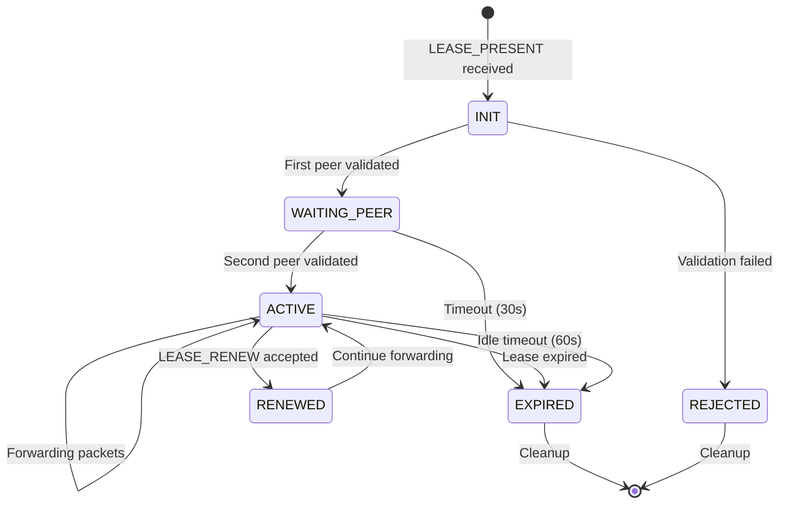

# Wavry Relay — Design Specification v0.1

**Status:** Draft — Pending Review

`wavry-relay` is a public relay node that volunteers can run. It registers with Wavry Master, receives encrypted UDP packets from peers, and forwards them under valid leases. The relay **never decrypts anything** — it is a blind pipe.

---

## Design Principles

| Principle | Rationale |
|-----------|-----------|
| **Zero knowledge** | Relay cannot decrypt traffic; E2EE between peers |
| **Stateless media** | No buffering beyond minimal forwarding queue |
| **UDP only** | No TCP tunneling; latency-first |
| **Fail fast** | Drop invalid traffic before expensive checks |
| **Lease-gated** | No forwarding without valid lease |

---

## 1. Boot & Registration

### 1.1 Keypair Management

On first boot, the relay generates an Ed25519 keypair and persists it:

```
~/.wavry-relay/
├── relay.key        # Ed25519 private key (chmod 600)
├── relay.pub        # Ed25519 public key
└── config.toml      # Configuration file
```

If `relay.key` exists, load it. Otherwise, generate and save.

### 1.2 Registration Flow

```
Relay                                   Master
   |                                       |
   |  POST /v1/relays/register             |
   |  { relay_id, endpoints[], ... }       |
   |-------------------------------------->|
   |                                       |
   |  200 { challenge }                    |
   |<--------------------------------------|
   |                                       |
   |  POST /v1/relays/register/verify      |
   |  { relay_id, signature(challenge) }   |
   |-------------------------------------->|
   |                                       |
   |  201 { relay_token, heartbeat_interval_ms } |
   |<--------------------------------------|
```

### 1.3 Endpoint Announcement

The relay auto-detects its public endpoints:
1. Bind UDP sockets to configured ports
2. Use STUN to discover public IP (if behind NAT)
3. Report all usable endpoints to Master

```rust
struct Endpoint {
    ip: IpAddr,
    port: u16,
    proto: Protocol,  // Always UDP for now
}
```

---

## 2. Heartbeat Protocol

### 2.1 Heartbeat Payload

```json
{
  "relay_id": "<base64url pubkey>",
  "active_sessions": 12,
  "bandwidth_in_mbps": 245.3,
  "bandwidth_out_mbps": 312.7,
  "packet_loss_pct": 0.02,
  "cpu_load_pct": 15.2,
  "memory_used_mb": 128,
  "uptime_secs": 86400
}
```

### 2.2 Heartbeat Timing

| Parameter | Default | Description |
|-----------|---------|-------------|
| `heartbeat_interval` | 30s | Normal heartbeat period |
| `heartbeat_timeout` | 90s | Master marks unhealthy after this |
| `heartbeat_jitter` | ±5s | Random jitter to avoid thundering herd |

### 2.3 Failure Handling

```
if missed_heartbeats >= 3:
    relay.status = UNHEALTHY
    exclude_from_selection()

if time_since_last_heartbeat > 5min:
    relay.status = OFFLINE
    remove_from_pool()
```

---

## 3. Lease Presentation Protocol

### 3.1 Wire Protocol

Peers present their lease to the relay before forwarding begins. This uses a minimal binary protocol on the relay's UDP socket.

**Packet Types:**

| Type ID | Name | Direction |
|---------|------|-----------|
| 0x01 | `LEASE_PRESENT` | Peer → Relay |
| 0x02 | `LEASE_ACK` | Relay → Peer |
| 0x03 | `LEASE_REJECT` | Relay → Peer |
| 0x04 | `LEASE_RENEW` | Peer → Relay |
| 0x10 | `FORWARD` | Bidirectional |

### 3.2 Packet Format

All packets share a common header:

```
 0                   1                   2                   3
 0 1 2 3 4 5 6 7 8 9 0 1 2 3 4 5 6 7 8 9 0 1 2 3 4 5 6 7 8 9 0 1
+-+-+-+-+-+-+-+-+-+-+-+-+-+-+-+-+-+-+-+-+-+-+-+-+-+-+-+-+-+-+-+-+
|  Magic (0x57) |    Version    |     Type      |    Flags      |
+-+-+-+-+-+-+-+-+-+-+-+-+-+-+-+-+-+-+-+-+-+-+-+-+-+-+-+-+-+-+-+-+
|                         Session ID                            |
|                         (16 bytes)                            |
|                                                               |
|                                                               |
+-+-+-+-+-+-+-+-+-+-+-+-+-+-+-+-+-+-+-+-+-+-+-+-+-+-+-+-+-+-+-+-+
|                         Payload...                           
+-+-+-+-+-+-+-+-+-+-+-+-+-+-+-+-+-+-+-+-+-+-+-+-+-+-+-+-+-+-+-+-+
```

- **Magic:** `0x57` ('W' for Wavry)
- **Version:** `0x01`
- **Type:** Packet type ID
- **Flags:** Reserved (must be 0)
- **Session ID:** 16-byte UUID from lease

### 3.3 LEASE_PRESENT (0x01)

```
Header (20 bytes)
+----------------------------------+
| Peer Role (1 byte: 0=client, 1=server) |
+----------------------------------+
| Lease Token Length (2 bytes, BE) |
+----------------------------------+
| Lease Token (PASETO v4.public)   |
| (variable length)                |
+----------------------------------+
```

### 3.4 LEASE_ACK (0x02)

```
Header (20 bytes)
+----------------------------------+
| Lease Expires (8 bytes, unix ms) |
+----------------------------------+
| Rate Limit Soft (4 bytes, kbps)  |
+----------------------------------+
| Rate Limit Hard (4 bytes, kbps)  |
+----------------------------------+
```

### 3.5 LEASE_REJECT (0x03)

```
Header (20 bytes)
+----------------------------------+
| Error Code (2 bytes)             |
+----------------------------------+
```

**Error Codes:**

| Code | Name | Description |
|------|------|-------------|
| 0x01 | `EXPIRED` | Lease has expired |
| 0x02 | `INVALID_SIGNATURE` | Token verification failed |
| 0x03 | `WRONG_RELAY` | Lease not for this relay |
| 0x04 | `SESSION_FULL` | Relay at capacity |
| 0x05 | `BANNED` | Peer is banned |
| 0x06 | `RATE_LIMITED` | Too many requests |

### 3.6 FORWARD (0x10)

```
Header (20 bytes)
+----------------------------------+
| Sequence Number (8 bytes, BE)    |
+----------------------------------+
| Payload (opaque, max 1400 bytes) |
+----------------------------------+
```

The payload is the encrypted RIFT packet. The relay does not inspect it.

---

## 4. Session State Machine



### 4.1 State Definitions

| State | Description | Timeout |
|-------|-------------|---------|
| `INIT` | First LEASE_PRESENT received, validating | 5s |
| `WAITING_PEER` | One peer ready, waiting for other | 30s |
| `ACTIVE` | Both peers ready, forwarding enabled | Lease expiry |
| `RENEWED` | Lease renewed, transitioning back to ACTIVE | — |
| `EXPIRED` | Session ended, cleaning up | — |
| `REJECTED` | Validation failed | — |

### 4.2 Session Data Structure

```rust
struct RelaySession {
    session_id: Uuid,
    state: SessionState,
    
    // Peer tracking
    client: Option<PeerState>,
    server: Option<PeerState>,
    
    // Lease info (from validated token)
    lease_expires: Instant,
    rate_limit: RateLimit,
    
    // Stats
    packets_forwarded: u64,
    bytes_forwarded: u64,
    created_at: Instant,
    last_activity: Instant,
}

struct PeerState {
    wavry_id: WavryId,
    socket_addr: SocketAddr,  // Last seen address
    last_seen: Instant,
    seq_window: SequenceWindow,
    rate_limiter: TokenBucket,
}
```

---

## 5. Forwarding Pipeline

### 5.1 Packet Flow

```
┌─────────────────────────────────────────────────────────────┐
│                     PACKET RECEIVED                          │
└─────────────────────────────────────────────────────────────┘
                              │
                              ▼
┌─────────────────────────────────────────────────────────────┐
│ 1. SIZE CHECK: len >= 20 && len <= 1500?                    │
│    → NO: drop (counter++)                                    │
└─────────────────────────────────────────────────────────────┘
                              │ YES
                              ▼
┌─────────────────────────────────────────────────────────────┐
│ 2. MAGIC CHECK: buf[0] == 0x57?                              │
│    → NO: drop (not wavry traffic)                            │
└─────────────────────────────────────────────────────────────┘
                              │ YES
                              ▼
┌─────────────────────────────────────────────────────────────┐
│ 3. SOURCE IP RATE LIMIT: ip_limiter.check(src_ip)?          │
│    → NO: drop (flood protection)                             │
└─────────────────────────────────────────────────────────────┘
                              │ YES
                              ▼
┌─────────────────────────────────────────────────────────────┐
│ 4. PARSE HEADER: extract session_id, type, seq              │
│    → FAIL: drop (malformed)                                  │
└─────────────────────────────────────────────────────────────┘
                              │ OK
                              ▼
┌─────────────────────────────────────────────────────────────┐
│ 5. SESSION LOOKUP: sessions.get(session_id)?                 │
│    → NONE + type == LEASE_PRESENT: create new session        │
│    → NONE + type != LEASE_PRESENT: drop (no session)         │
└─────────────────────────────────────────────────────────────┘
                              │ FOUND
                              ▼
┌─────────────────────────────────────────────────────────────┐
│ 6. TYPE DISPATCH:                                            │
│    → LEASE_PRESENT: validate_lease()                         │
│    → LEASE_RENEW: renew_lease()                              │
│    → FORWARD: forward_packet()                               │
└─────────────────────────────────────────────────────────────┘
```

### 5.2 Forward Packet Handler

```rust
fn forward_packet(session: &mut RelaySession, src: SocketAddr, pkt: &Packet) -> Result<()> {
    // 1. Session must be ACTIVE
    if session.state != SessionState::Active {
        return Err(Error::SessionNotActive);
    }
    
    // 2. Check lease not expired
    if Instant::now() > session.lease_expires {
        session.state = SessionState::Expired;
        return Err(Error::LeaseExpired);
    }
    
    // 3. Identify sender and receiver
    let (sender, receiver) = match session.identify_peer(src) {
        Some((s, r)) => (s, r),
        None => return Err(Error::UnknownPeer),
    };
    
    // 4. Sequence number check (replay protection)
    if !sender.seq_window.check_and_update(pkt.seq) {
        return Err(Error::ReplayDetected);
    }
    
    // 5. Per-peer rate limit
    if !sender.rate_limiter.consume(pkt.len()) {
        return Err(Error::RateLimited);
    }
    
    // 6. Update last seen (for NAT rebinding)
    sender.socket_addr = src;
    sender.last_seen = Instant::now();
    session.last_activity = Instant::now();
    
    // 7. Forward to other peer
    socket.send_to(&pkt.raw, receiver.socket_addr)?;
    
    // 8. Update stats
    session.packets_forwarded += 1;
    session.bytes_forwarded += pkt.len() as u64;
    
    Ok(())
}
```

### 5.3 Lease Validation (Cached)

```rust
struct LeaseCache {
    // token_hash -> (validated_claims, expires_at)
    cache: HashMap<[u8; 32], (LeaseClaims, Instant)>,
}

fn validate_lease(token: &str) -> Result<LeaseClaims> {
    let token_hash = blake3::hash(token.as_bytes());
    
    // Check cache first
    if let Some((claims, expires)) = self.lease_cache.get(&token_hash) {
        if Instant::now() < *expires {
            return Ok(claims.clone());
        }
    }
    
    // Expensive: verify PASETO signature
    let claims = paseto::verify(token, &MASTER_PUBLIC_KEY)?;
    
    // Validate claims
    if claims.relay_id != self.relay_id {
        return Err(Error::WrongRelay);
    }
    if claims.exp < now_unix() {
        return Err(Error::Expired);
    }
    if claims.nbf > now_unix() + MAX_CLOCK_SKEW_SECS {
        return Err(Error::NotYetValid);
    }
    
    // Cache for future lookups
    let cache_until = Instant::now() + Duration::from_secs(claims.exp - now_unix());
    self.lease_cache.insert(token_hash, (claims.clone(), cache_until));
    
    Ok(claims)
}
```

---

## 6. Rate Limiting Strategy

### 6.1 Layers of Rate Limiting

```
┌─────────────────────────────────────────────────────────────┐
│ Layer 1: Global Relay Limit                                  │
│ - Total bandwidth cap (from capacity announcement)          │
│ - Max concurrent sessions                                    │
└─────────────────────────────────────────────────────────────┘
                              │
                              ▼
┌─────────────────────────────────────────────────────────────┐
│ Layer 2: Per-Source-IP Limit                                 │
│ - Packets per second (before session lookup)                │
│ - Prevents flood attacks from unknown sources               │
└─────────────────────────────────────────────────────────────┘
                              │
                              ▼
┌─────────────────────────────────────────────────────────────┐
│ Layer 3: Per-Session Limit                                   │
│ - From lease: soft_mbps, hard_mbps                          │
│ - Soft limit: log warning                                   │
│ - Hard limit: drop packets                                  │
└─────────────────────────────────────────────────────────────┘
                              │
                              ▼
┌─────────────────────────────────────────────────────────────┐
│ Layer 4: Per-Peer Limit                                      │
│ - Each peer in session has independent bucket               │
│ - Prevents asymmetric abuse                                 │
└─────────────────────────────────────────────────────────────┘
```

### 6.2 Token Bucket Parameters

```rust
struct TokenBucket {
    tokens: f64,
    capacity: f64,      // Max burst size
    refill_rate: f64,   // Tokens per millisecond
    last_refill: Instant,
}

impl TokenBucket {
    fn consume(&mut self, amount: usize) -> bool {
        self.refill();
        if self.tokens >= amount as f64 {
            self.tokens -= amount as f64;
            true
        } else {
            false
        }
    }
}
```

### 6.3 Default Rate Limits

| Layer | Limit | Default |
|-------|-------|---------|
| Global | Max sessions | 100 |
| Global | Max bandwidth | 1 Gbps |
| Per-IP | Packets/sec | 1000 |
| Per-IP | Bytes/sec | 10 MB |
| Per-Session | Soft limit | 50 Mbps |
| Per-Session | Hard limit | 100 Mbps |
| Per-Peer | Packets/sec | 5000 |

---

## 7. DoS Resistance

### 7.1 Stateless Pre-Checks

Before any state lookup or crypto:

```rust
fn stateless_precheck(buf: &[u8], src: SocketAddr) -> bool {
    // 1. Size bounds
    if buf.len() < 20 || buf.len() > 1500 {
        return false;
    }
    
    // 2. Magic byte
    if buf[0] != 0x57 {
        return false;
    }
    
    // 3. Version
    if buf[1] != 0x01 {
        return false;
    }
    
    // 4. Per-IP rate limit (lockless atomic counter)
    if !IP_RATE_LIMITER.check(src.ip()) {
        return false;
    }
    
    true
}
```

### 7.2 Expensive Operation Gating

| Operation | Gate |
|-----------|------|
| PASETO verification | Only for LEASE_PRESENT; cached thereafter |
| Session creation | After successful lease validation |
| Hashmap lookup | After stateless checks pass |
| Memory allocation | Bounded session pool |

### 7.3 Subnet-Level Blocking

```rust
struct SubnetBlocker {
    // /24 for IPv4, /48 for IPv6
    blocked_subnets: HashSet<IpNet>,
    violation_counts: HashMap<IpNet, (u32, Instant)>,
}

impl SubnetBlocker {
    fn record_violation(&mut self, ip: IpAddr) {
        let subnet = to_subnet(ip);
        let (count, first_seen) = self.violation_counts
            .entry(subnet)
            .or_insert((0, Instant::now()));
        
        *count += 1;
        
        // Block subnet if > 1000 violations in 60 seconds
        if *count > 1000 && first_seen.elapsed() < Duration::from_secs(60) {
            self.blocked_subnets.insert(subnet);
            log::warn!("Blocked subnet {} due to abuse", subnet);
        }
    }
}
```

---

## 8. Sequence Number Window

### 8.1 Implementation

```rust
struct SequenceWindow {
    base: u64,           // Lowest acceptable sequence
    bitmap: u128,        // Sliding window bitmap (128 packets)
}

impl SequenceWindow {
    const WINDOW_SIZE: u64 = 128;
    
    fn check_and_update(&mut self, seq: u64) -> bool {
        if seq < self.base {
            // Too old
            return false;
        }
        
        let offset = seq - self.base;
        
        if offset >= Self::WINDOW_SIZE {
            // Ahead of window - advance
            let shift = offset - Self::WINDOW_SIZE + 1;
            self.base += shift;
            self.bitmap >>= shift.min(128);
        }
        
        let bit_pos = (seq - self.base) as u32;
        let mask = 1u128 << bit_pos;
        
        if self.bitmap & mask != 0 {
            // Already seen (replay)
            return false;
        }
        
        self.bitmap |= mask;
        true
    }
}
```

---

## 9. CLI & Configuration

### 9.1 CLI Flags

```
wavry-relay [OPTIONS]

OPTIONS:
    --config <PATH>           Config file path [default: ~/.wavry-relay/config.toml]
    --master <URL>            Wavry Master URL [default: https://master.wavry.io]
    --listen <ADDR:PORT>      UDP listen address [default: 0.0.0.0:4000]
    --listen-v6 <ADDR:PORT>   IPv6 listen address [default: [::]:4000]
    --region <REGION>         Geographic region hint
    --max-sessions <N>        Max concurrent sessions [default: 100]
    --max-bandwidth <MBPS>    Max total bandwidth [default: 1000]
    --key-file <PATH>         Ed25519 key file [default: ~/.wavry-relay/relay.key]
    --metrics-port <PORT>     Prometheus metrics port [default: 9090]
    --log-level <LEVEL>       Log level [default: info]
    --no-ipv6                 Disable IPv6
    --dry-run                 Validate config and exit
```

### 9.2 Configuration File

```toml
# ~/.wavry-relay/config.toml

[master]
url = "https://master.wavry.io"
# Master's public key for lease verification (base64)
public_key = "MCowBQYDK2VwAyEA..."

[identity]
key_file = "~/.wavry-relay/relay.key"

[network]
listen = "0.0.0.0:4000"
listen_v6 = "[::]:4000"
enable_ipv6 = true

[capacity]
max_sessions = 100
max_bandwidth_mbps = 1000

[region]
name = "us-east-1"
# Optional ASN (auto-detected if not set)
# asn = 15169

[features]
udp = true
ipv6 = true
fec = true

[rate_limits]
per_ip_pps = 1000
per_ip_mbps = 10
per_session_soft_mbps = 50
per_session_hard_mbps = 100

[timeouts]
session_idle_secs = 60
lease_grace_secs = 30
peer_wait_secs = 30

[heartbeat]
interval_secs = 30
jitter_secs = 5

[metrics]
enabled = true
listen = "127.0.0.1:9090"

[logging]
level = "info"
format = "json"  # or "pretty"
```

---

## 10. Safe Defaults

> [!IMPORTANT]
> These defaults are designed for safety. Operators can tune for performance after validating their environment.

| Setting | Safe Default | Rationale |
|---------|--------------|-----------|
| `max_sessions` | 100 | Prevents memory exhaustion |
| `max_bandwidth_mbps` | 1000 | Matches typical 1Gbps server |
| `per_ip_pps` | 1000 | Blocks UDP floods |
| `session_idle_secs` | 60 | Frees resources for idle sessions |
| `heartbeat_interval` | 30s | Balances responsiveness vs overhead |
| `lease_cache_size` | 1000 | Caps memory for lease cache |
| `seq_window_size` | 128 | Standard replay window |
| `log_level` | info | No debug noise by default |
| `metrics_bind` | 127.0.0.1 | Not exposed externally |
| `enable_ipv6` | true | Dual-stack by default |

### 10.1 Security Defaults

| Setting | Default | Rationale |
|---------|---------|-----------|
| Key file permissions | 0600 | Private key protection |
| Config file permissions | 0644 | No secrets in config |
| Master public key | Required | No insecure fallback |
| TLS for master | Required | No plaintext to master |
| PASETO verification | Always | Never skip signature check |

---

## 11. Metrics

### 11.1 Prometheus Metrics

```
# Sessions
wavry_relay_sessions_active{state="active|waiting|expired"}
wavry_relay_sessions_total{result="success|rejected|expired"}

# Traffic
wavry_relay_packets_forwarded_total
wavry_relay_bytes_forwarded_total
wavry_relay_packets_dropped_total{reason="rate_limit|replay|invalid|no_session"}

# Rate limiting
wavry_relay_rate_limit_hits_total{layer="global|ip|session|peer"}

# Lease validation
wavry_relay_lease_validations_total{result="valid|expired|invalid_sig|wrong_relay"}
wavry_relay_lease_cache_hits_total
wavry_relay_lease_cache_misses_total

# Health
wavry_relay_heartbeat_last_success_timestamp
wavry_relay_uptime_seconds
wavry_relay_cpu_usage_percent
wavry_relay_memory_used_bytes
```

---

## 12. Graceful Shutdown

```rust
async fn shutdown(sessions: Arc<SessionPool>) {
    // 1. Stop accepting new sessions
    sessions.set_accepting(false);
    
    // 2. Notify master we're draining
    master_client.send_draining().await;
    
    // 3. Wait for active sessions to complete (max 30s)
    let deadline = Instant::now() + Duration::from_secs(30);
    while sessions.active_count() > 0 && Instant::now() < deadline {
        tokio::time::sleep(Duration::from_millis(100)).await;
    }
    
    // 4. Force close remaining sessions
    sessions.close_all();
    
    // 5. Deregister from master
    master_client.deregister().await;
}
```

---

## Appendix A: Complete Packet Examples

### A.1 LEASE_PRESENT Packet (Hex)

```
57 01 01 00                          # Magic, Version, Type=LEASE_PRESENT, Flags
a1 b2 c3 d4 e5 f6 a7 b8              # Session ID (16 bytes)
c9 d0 e1 f2 a3 b4 c5 d6
00                                    # Peer Role = 0 (client)
01 2c                                 # Token Length = 300 bytes (BE)
76 34 2e 70 75 62 6c 69 63 2e ...    # PASETO token (v4.public.ey...)
```

### A.2 FORWARD Packet (Hex)

```
57 01 10 00                          # Magic, Version, Type=FORWARD, Flags
a1 b2 c3 d4 e5 f6 a7 b8              # Session ID (16 bytes)
c9 d0 e1 f2 a3 b4 c5 d6
00 00 00 00 00 00 00 2a              # Sequence Number = 42 (BE)
[encrypted RIFT payload...]           # Opaque encrypted data
```
