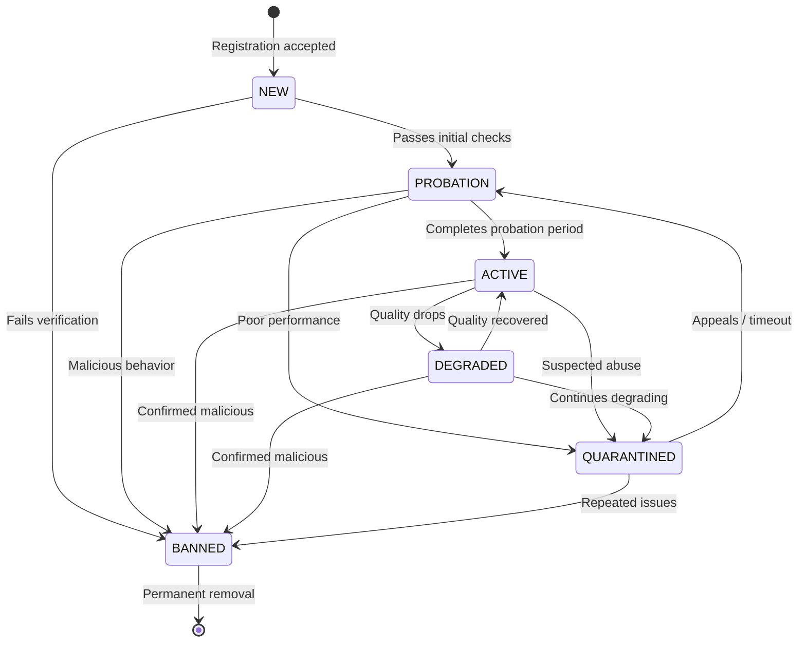
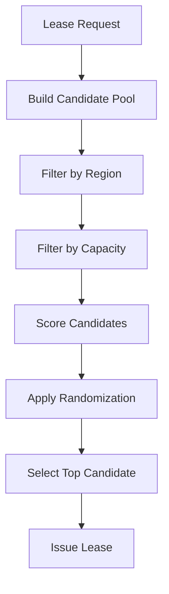

# Wavry Relay Selection & Reputation — Design Specification v0.1

**Status:** Draft — Pending Review

This document defines how Wavry Master selects relays for session establishment and how it maintains a trust model for public volunteer relays.

---

## Goals

| Goal | Description |
|------|-------------|
| **Minimize latency** | Pick relays close to both peers |
| **Maximize stability** | Avoid flaky or overloaded relays |
| **Detect malicious relays** | Identify droppers, jitter monsters, data exfiltrators |
| **Fairness** | Distribute load; don't always pick the same node |
| **Privacy** | No deep traffic analysis; work with minimal metadata |

---

## 1. Relay Lifecycle States



### 1.1 State Definitions

| State | Description | Selection | Duration |
|-------|-------------|-----------|----------|
| `NEW` | Just registered, unproven | Never selected | Until probed |
| `PROBATION` | Under evaluation | Limited selection | 7 days or 100 sessions |
| `ACTIVE` | Fully trusted | Full selection | Indefinite |
| `DEGRADED` | Quality issues detected | Reduced priority | 24h observation |
| `QUARANTINED` | Suspected malicious | Never selected | 7 days for appeal |
| `BANNED` | Confirmed malicious | Never selected | Permanent |

### 1.2 State Transitions Table

| From | To | Trigger |
|------|----|---------|
| NEW → PROBATION | Passes health probe + endpoint verification |
| NEW → BANNED | Fails verification 3 times |
| PROBATION → ACTIVE | 100 successful sessions + 7 days + score > 80 |
| PROBATION → QUARANTINED | Score drops below 40 |
| ACTIVE → DEGRADED | Score drops below 60 |
| DEGRADED → ACTIVE | Score recovers above 70 for 24h |
| DEGRADED → QUARANTINED | Score below 40 for 24h |
| any → BANNED | Multiple client reports + manual review |
| QUARANTINED → PROBATION | 7 day timeout + operator appeal |

---

## 2. Quality Metrics

### 2.1 Collected Signals

| Signal | Source | Collection Method | Weight |
|--------|--------|-------------------|--------|
| `session_success_rate` | Master DB | % sessions that reach ACTIVE state | 25% |
| `handshake_timeout_rate` | Master DB | % sessions stuck in WAITING_PEER | 15% |
| `session_duration` | Master DB | Average session length vs expected | 10% |
| `client_feedback` | Client reports | Signed quality reports (0-100) | 20% |
| `probe_rtt` | Master probe | UDP ping RTT in ms | 15% |
| `probe_loss` | Master probe | % probe packets lost | 10% |
| `capacity_accuracy` | Observed | Claimed vs actual throughput | 5% |

### 2.2 Signal Authentication

**Client Feedback** is signed to prevent spoofing:

```json
{
  "session_id": "<uuid>",
  "relay_id": "<relay pubkey>",
  "quality_score": 85,
  "issues": ["jitter"],
  "timestamp": 1706969400,
  "signature": "<ed25519 sig by client>"
}
```

Validation:
1. Verify signature against client's Wavry ID
2. Check session existed and client was a participant
3. Check timestamp within ±5 minutes of session end
4. Rate limit: 1 report per session per client

### 2.3 Probe Protocol

Master sends periodic UDP probes to verify relay reachability:

```
Master                                  Relay
   |                                       |
   |  PROBE_REQ (nonce, timestamp)         |
   |-------------------------------------->|
   |                                       |
   |  PROBE_RSP (nonce, relay_stats)       |
   |<--------------------------------------|
   |                                       |
   |  RTT = now - timestamp                |
```

**Probe Packet Format:**

```
PROBE_REQ:
  magic: 0x57
  type: 0x20
  nonce: [16 bytes]
  timestamp: u64 (unix ms)

PROBE_RSP:
  magic: 0x57
  type: 0x21
  nonce: [16 bytes echo]
  active_sessions: u16
  bandwidth_pct: u8
```

**Probe Schedule:**
- Every 60 seconds for ACTIVE relays
- Every 30 seconds for PROBATION relays
- Every 5 minutes for DEGRADED relays (to detect recovery)

---

## 3. Scoring Function

### 3.1 Base Score Calculation

```python
def calculate_relay_score(relay: Relay, metrics: Metrics) -> float:
    """
    Calculate relay quality score (0-100).
    Higher is better.
    """
    
    # Component scores (each 0-100)
    success_score = metrics.session_success_rate * 100
    handshake_score = (1 - metrics.handshake_timeout_rate) * 100
    duration_score = min(metrics.avg_duration / metrics.expected_duration, 1.0) * 100
    feedback_score = metrics.avg_client_feedback or 50  # Default if no feedback
    rtt_score = max(0, 100 - (metrics.probe_rtt_ms / 5))  # 0ms=100, 500ms=0
    loss_score = (1 - metrics.probe_loss_rate) * 100
    capacity_score = min(metrics.observed_capacity / metrics.claimed_capacity, 1.0) * 100
    
    # Weighted combination
    score = (
        success_score * 0.25 +
        handshake_score * 0.15 +
        duration_score * 0.10 +
        feedback_score * 0.20 +
        rtt_score * 0.15 +
        loss_score * 0.10 +
        capacity_score * 0.05
    )
    
    # Apply state multipliers
    state_multiplier = {
        'NEW': 0.0,        # Never select
        'PROBATION': 0.5,  # Half priority
        'ACTIVE': 1.0,     # Full priority
        'DEGRADED': 0.3,   # Reduced priority
        'QUARANTINED': 0.0,# Never select
        'BANNED': 0.0,     # Never select
    }
    
    return score * state_multiplier[relay.state]
```

### 3.2 Time Decay

Recent metrics matter more than old ones:

```python
def apply_time_decay(metrics: List[MetricPoint], half_life_hours: int = 24) -> float:
    """
    Exponential decay weighting for metrics.
    """
    now = time.time()
    total_weight = 0
    weighted_sum = 0
    
    for point in metrics:
        age_hours = (now - point.timestamp) / 3600
        weight = 0.5 ** (age_hours / half_life_hours)
        weighted_sum += point.value * weight
        total_weight += weight
    
    return weighted_sum / total_weight if total_weight > 0 else 0
```

### 3.3 Score Thresholds

| Score Range | Interpretation | Action |
|-------------|----------------|--------|
| 90-100 | Excellent | Prefer for latency-sensitive sessions |
| 70-89 | Good | Normal selection pool |
| 60-69 | Fair | Reduced selection weight |
| 40-59 | Poor | Trigger DEGRADED state |
| 0-39 | Critical | Trigger QUARANTINE review |

---

## 4. Selection Algorithm

### 4.1 Overview



### 4.2 Candidate Pool Building

```python
def build_candidate_pool(
    client_region: str,
    server_region: str,
    required_features: List[str]
) -> List[Relay]:
    """
    Build initial candidate pool from all healthy relays.
    """
    candidates = []
    
    for relay in all_relays:
        # Must be selectable
        if relay.state not in ['PROBATION', 'ACTIVE', 'DEGRADED']:
            continue
        
        # Must be healthy (recent heartbeat)
        if relay.last_heartbeat < now - timedelta(seconds=90):
            continue
        
        # Must support required features
        if not all(f in relay.features for f in required_features):
            continue
        
        # Must have capacity
        if relay.active_sessions >= relay.max_sessions * 0.95:
            continue
        
        candidates.append(relay)
    
    return candidates
```

### 4.3 Geographic Filtering

```python
def filter_by_geography(
    candidates: List[Relay],
    client_region: str,
    server_region: str,
    max_candidates: int = 10
) -> List[Relay]:
    """
    Prefer relays geographically close to both peers.
    """
    
    def geo_distance_score(relay):
        # Lower is better
        client_dist = region_distance(relay.region, client_region)
        server_dist = region_distance(relay.region, server_region)
        return client_dist + server_dist
    
    # Sort by geographic proximity
    candidates.sort(key=geo_distance_score)
    
    # Take top candidates, ensuring diversity
    result = []
    seen_asns = set()
    
    for relay in candidates:
        if len(result) >= max_candidates:
            break
        
        # ASN diversity: max 2 relays per ASN
        if seen_asns.get(relay.asn, 0) >= 2:
            continue
        
        result.append(relay)
        seen_asns[relay.asn] = seen_asns.get(relay.asn, 0) + 1
    
    return result
```

### 4.4 Weighted Random Selection

```python
def select_relay(candidates: List[Relay]) -> Relay:
    """
    Select relay using weighted random choice.
    This ensures load distribution while respecting quality scores.
    """
    if not candidates:
        raise NoRelaysAvailable()
    
    # Calculate selection weights
    scores = [calculate_relay_score(r) for r in candidates]
    min_score = min(scores)
    
    # Shift to ensure all weights are positive
    weights = [s - min_score + 10 for s in scores]
    
    # Add exploration bonus for PROBATION relays
    for i, r in enumerate(candidates):
        if r.state == 'PROBATION':
            weights[i] *= 1.2  # 20% bonus to get more data
    
    # Weighted random selection
    total = sum(weights)
    r = random.uniform(0, total)
    
    cumulative = 0
    for relay, weight in zip(candidates, weights):
        cumulative += weight
        if r <= cumulative:
            return relay
    
    return candidates[-1]  # Fallback
```

### 4.5 Hot-Spot Prevention

To prevent always selecting the same high-scoring relay:

1. **Weighted randomization** (above) ensures variety
2. **Recent selection penalty**: Reduce weight if selected in last N sessions

```python
def apply_recent_selection_penalty(relay: Relay, weight: float) -> float:
    """
    Reduce weight if relay was recently selected.
    """
    recent_selections = count_selections_last_minute(relay.id)
    
    # Halve weight for every 10 recent selections
    penalty = 0.5 ** (recent_selections / 10)
    
    return weight * penalty
```

---

## 5. Abuse Prevention

### 5.1 Lease Issuance Caps

| Cap Type | Limit | Window | Action |
|----------|-------|--------|--------|
| Per-user leases | 10 | 1 minute | 429 Too Many Requests |
| Per-user sessions | 100 | 1 hour | 429 + alert |
| Per-relay sessions | max_sessions | — | Exclude from selection |
| Per-IP registrations | 5 | 24 hours | Reject new relays |

### 5.2 Sybil Relay Detection

Attackers may register many relays to increase selection probability or gain disproportionate reputation.

**Detection Signals:**

| Signal | Threshold | Action |
|--------|-----------|--------|
| Same IP multiple relays | > 2 | Flag for review |
| Same /24 subnet | > 5 | Flag for review |
| Same ASN | > 10 | Require operator verification |
| Correlated registration time | Within 1 hour | Flag cluster |
| Similar endpoint patterns | Jaccard > 0.8 | Flag cluster |
| Correlated failure patterns | > 0.9 correlation | Quarantine cluster |

**Mitigation:**

```python
def check_sybil_indicators(new_relay: Relay) -> List[str]:
    """
    Check for Sybil attack indicators.
    Returns list of warnings.
    """
    warnings = []
    
    # Check IP cluster
    same_ip = count_relays_by_ip(new_relay.endpoints[0].ip)
    if same_ip >= 2:
        warnings.append(f"IP already has {same_ip} relays")
    
    # Check subnet cluster
    subnet = to_subnet_24(new_relay.endpoints[0].ip)
    same_subnet = count_relays_by_subnet(subnet)
    if same_subnet >= 5:
        warnings.append(f"Subnet has {same_subnet} relays")
    
    # Check ASN cluster
    if new_relay.asn:
        same_asn = count_relays_by_asn(new_relay.asn)
        if same_asn >= 10:
            warnings.append(f"ASN {new_relay.asn} has {same_asn} relays")
    
    return warnings
```

### 5.3 Relay Griefing Detection

"Griefing" relays accept sessions then intentionally drop packets:

**Detection:**

1. **Session success rate** < 50% over 24 hours
2. **Handshake timeout rate** > 30%
3. **Negative client feedback** from > 5 unique clients
4. **Probe success** but session failures = intentional dropping

**Response:**

```python
def detect_griefing(relay: Relay) -> GriefingIndicator:
    metrics = get_relay_metrics(relay.id, window_hours=24)
    
    indicators = []
    
    if metrics.session_success_rate < 0.5:
        indicators.append("LOW_SUCCESS_RATE")
    
    if metrics.handshake_timeout_rate > 0.3:
        indicators.append("HIGH_TIMEOUT_RATE")
    
    negative_feedback = count_feedback_below(relay.id, threshold=30)
    if negative_feedback > 5:
        indicators.append("NEGATIVE_FEEDBACK")
    
    # Key indicator: probes work but sessions fail
    if metrics.probe_success_rate > 0.95 and metrics.session_success_rate < 0.5:
        indicators.append("SELECTIVE_DROPPING")
    
    if len(indicators) >= 2:
        return GriefingIndicator(
            relay_id=relay.id,
            confidence='HIGH' if len(indicators) >= 3 else 'MEDIUM',
            indicators=indicators
        )
    
    return None
```

---

## 6. Data Model Extensions

### 6.1 Relay Metrics Table

```sql
CREATE TABLE relay_metrics (
    id UUID PRIMARY KEY DEFAULT gen_random_uuid(),
    relay_id TEXT NOT NULL REFERENCES relays(relay_id),
    timestamp TIMESTAMPTZ NOT NULL DEFAULT now(),
    
    -- Session metrics
    sessions_started INT NOT NULL DEFAULT 0,
    sessions_succeeded INT NOT NULL DEFAULT 0,
    sessions_failed INT NOT NULL DEFAULT 0,
    handshake_timeouts INT NOT NULL DEFAULT 0,
    avg_session_duration_secs FLOAT,
    
    -- Probe metrics
    probe_rtt_ms FLOAT,
    probe_loss_rate FLOAT,
    
    -- Aggregate metrics (rolled up)
    period_type TEXT NOT NULL,  -- 'hourly', 'daily'
    
    UNIQUE(relay_id, timestamp, period_type)
);

CREATE INDEX idx_relay_metrics_relay_time 
    ON relay_metrics(relay_id, timestamp DESC);
```

### 6.2 Client Feedback Table

```sql
CREATE TABLE client_feedback (
    id UUID PRIMARY KEY DEFAULT gen_random_uuid(),
    session_id UUID NOT NULL REFERENCES sessions(session_id),
    relay_id TEXT NOT NULL REFERENCES relays(relay_id),
    client_id TEXT NOT NULL REFERENCES users(wavry_id),
    
    quality_score INT NOT NULL CHECK (quality_score BETWEEN 0 AND 100),
    issues TEXT[] DEFAULT '{}',
    
    signature TEXT NOT NULL,
    created_at TIMESTAMPTZ NOT NULL DEFAULT now(),
    
    UNIQUE(session_id, client_id)  -- One feedback per session per client
);
```

### 6.3 Relay State History

```sql
CREATE TABLE relay_state_history (
    id UUID PRIMARY KEY DEFAULT gen_random_uuid(),
    relay_id TEXT NOT NULL REFERENCES relays(relay_id),
    
    old_state TEXT NOT NULL,
    new_state TEXT NOT NULL,
    
    reason TEXT,
    triggered_by TEXT,  -- 'auto', 'admin', 'appeal'
    
    created_at TIMESTAMPTZ NOT NULL DEFAULT now()
);
```

---

## 7. API Extensions

### 7.1 Client Feedback Endpoint

```
POST /v1/feedback
Authorization: Bearer <session_token>

{
  "session_id": "<uuid>",
  "relay_id": "<relay pubkey>",
  "quality_score": 85,
  "issues": ["jitter", "packet_loss"],
  "signature": "<ed25519 sig>"
}
```

**Response:**
```json
{
  "data": {
    "accepted": true
  }
}
```

### 7.2 Relay Stats Endpoint (for relay operators)

```
GET /v1/relays/{relay_id}/stats
Authorization: Bearer <relay_token>
```

**Response:**
```json
{
  "data": {
    "state": "ACTIVE",
    "score": 87.5,
    "metrics": {
      "session_success_rate": 0.94,
      "handshake_timeout_rate": 0.02,
      "avg_session_duration_secs": 1847,
      "probe_rtt_ms": 12.3,
      "probe_loss_rate": 0.001
    },
    "selection_count_24h": 342,
    "feedback_count_24h": 28,
    "avg_feedback_score": 82
  }
}
```

---

## 8. Probation Logic

### 8.1 Probation Requirements

New relays must complete probation before becoming ACTIVE:

| Requirement | Threshold | Rationale |
|-------------|-----------|-----------|
| Minimum age | 7 days | Time-based observation |
| Minimum sessions | 100 | Statistical significance |
| Session success rate | > 90% | Quality floor |
| Handshake timeout rate | < 10% | Reliability floor |
| Average feedback score | > 70 | User satisfaction |
| Probe success rate | > 99% | Reachability |

### 8.2 Probation Graduation

```python
def check_probation_graduation(relay: Relay) -> bool:
    """
    Check if relay can graduate from PROBATION to ACTIVE.
    """
    if relay.state != 'PROBATION':
        return False
    
    # Check age
    age = now() - relay.created_at
    if age < timedelta(days=7):
        return False
    
    # Get probation-period metrics
    metrics = get_aggregate_metrics(
        relay.id, 
        since=relay.created_at
    )
    
    # Check all requirements
    if metrics.total_sessions < 100:
        return False
    
    if metrics.session_success_rate < 0.90:
        return False
    
    if metrics.handshake_timeout_rate > 0.10:
        return False
    
    if metrics.avg_feedback_score and metrics.avg_feedback_score < 70:
        return False
    
    if metrics.probe_success_rate < 0.99:
        return False
    
    # Calculate quality score
    score = calculate_relay_score(relay, metrics)
    if score < 80:
        return False
    
    return True
```

---

## 9. Synthetic Probes (Optional)

For higher confidence, Master can run synthetic sessions:

### 9.1 Synthetic Session Flow

```
Master spawns two probe clients (different IPs if possible):
  Client A  ─────┐
                 ├───► Relay ───► Check packets received
  Client B  ─────┘
```

1. Master issues test leases to probe clients
2. Probe clients exchange encrypted ping packets through relay
3. Measure: latency, loss, corruption
4. Compare to probe-only RTT

### 9.2 When to Run Synthetic Probes

- New relays: Once during first 24h of probation
- On state transition: DEGRADED → review
- Periodic spot-check: 1% of ACTIVE relays per day
- On anomaly: Score drops > 20 points suddenly

---

## 10. Summary Tables

### 10.1 State → Allowed Actions

| State | Selected | Heartbeat | Can Appeal | Visible in List |
|-------|----------|-----------|------------|-----------------|
| NEW | ❌ | ✅ | — | ❌ |
| PROBATION | ⚠️ Limited | ✅ | — | ✅ |
| ACTIVE | ✅ | ✅ | — | ✅ |
| DEGRADED | ⚠️ Reduced | ✅ | — | ✅ |
| QUARANTINED | ❌ | ✅ | ✅ | ❌ |
| BANNED | ❌ | ❌ | ❌ | ❌ |

### 10.2 Metrics Collection Frequency

| Metric | Collection | Aggregation | Retention |
|--------|------------|-------------|-----------|
| Session success | Per-session | Hourly roll-up | 90 days |
| Probe RTT | Every 60s | Hourly average | 30 days |
| Client feedback | Per-session | Per-relay average | 90 days |
| Heartbeat stats | Every 30s | Latest only | — |

### 10.3 Score Impact Examples

| Event | Score Impact | Duration |
|-------|--------------|----------|
| Session timeout | -0.5 | Immediate |
| Client reports 0 (worst) | -2.0 | Immediate |
| Missed probe | -1.0 | Until next probe |
| 10 successful sessions | +0.1 | Immediate |
| 24h with 100% success | +5.0 | Next recalc |
